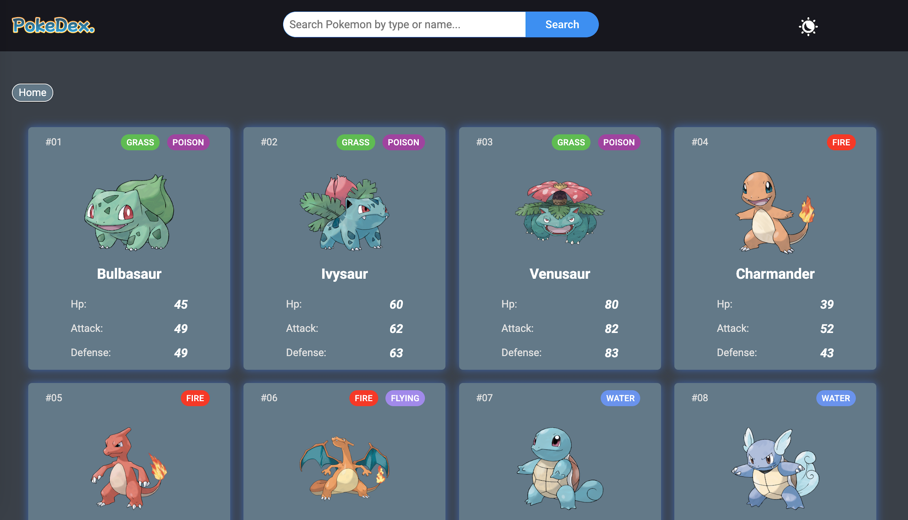

# Pokédexio Web App

A modern, responsive Pokédex web application built with vanilla JavaScript, HTML, and CSS. Browse, search, and filter Pokémon, view detailed stats and evolution chains, and enjoy a smooth user experience with dark mode and loading animations.

# Preview



# Features

- Fast Search: Search Pokémon by name or type.
- Type Filtering: Click on type badges to filter Pokémon.
- Detailed Modal: View stats, abilities, and evolution chains in a modal.
- Dark/Light Mode: Toggle between light and dark themes.
- Responsive Design: Works great on mobile and desktop.

# Project Structure

```
/pokedex
  ├── assets/
  ├── app.js
  ├── index.html
  └── styles.css
```

# Credits

PokeAPI for Pokémon data

# License

This project is open-source and available under the MIT License.
